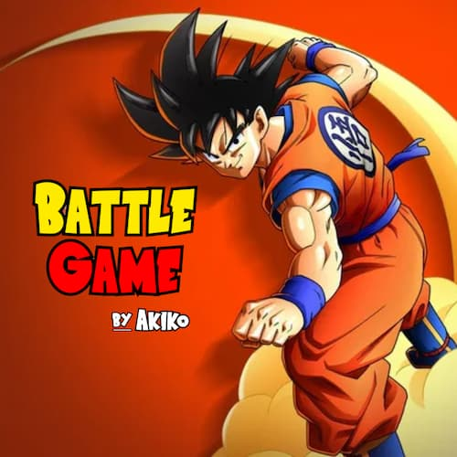
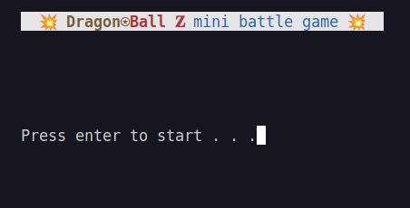
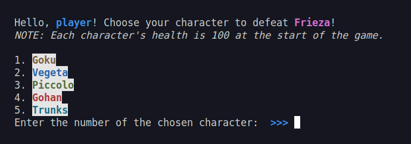
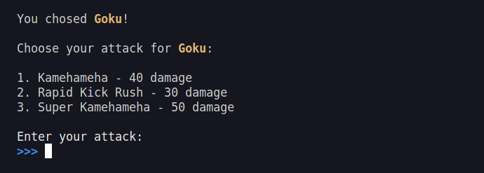
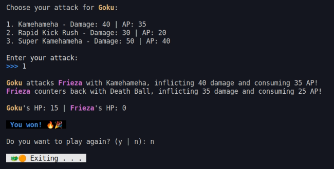

# PB - Programming Basics Final Project at DCI Digital Career Institute.

## DragonBall Z mini battle game

Photo edit by: [@Pilag6](https://github.com/Pilag6)

### Overview:
The Dragon⍟Ball 𝐙 Mini Battle Game is a turn-based console game built using `Node.js` for a project. It engages players in battles against the default opponent, Frieza, offering a Dragon Ball Z-themed gaming experience. The game uses `readline-sync` to create an interactive game and `chalk` to enhance console output with colorful visuals.

### Tools used:
- Node.js
- npm
- Git
- VSCode

### Game rule:
1. Press `enter` to start the game.
2. Enter your username.
3. Choose a character to defeat Frieza.
4. Choose an attack.
5. Press `y` if you want to play again, press `n` to exit.

#### Screenshots:

