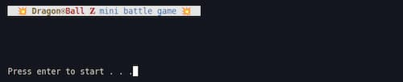
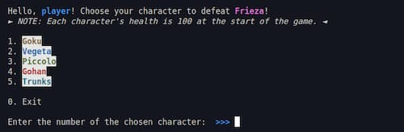
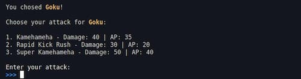
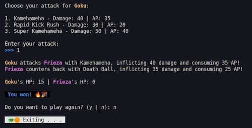

# PB - Programming Basics Final Project at DCI Digital Career Institute.

<h2 align="center">DragonBall Z mini battle game</h2>

  

Photo edit by: Pila Gonzalez

### Tools used:
- Node.js
- npm
- Git
- VSCode

### Game rule:
1. Press enter to start the game.
2. Enter your username.
3. Choose a character to defeat Frieza.
4. Choose an attack.
5. Press **y** if you want to play again, press **n** to exit.

#### Screenshots:

