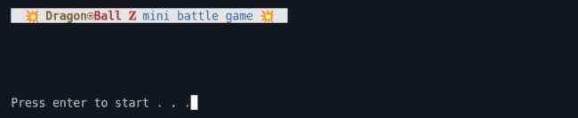
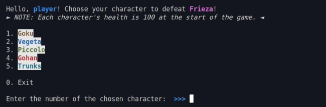

# PB - Programming Basics Final Project at DCI Digital Career Institute

## Dragon⍟Ball 𝐙 mini battle game

Photo edit by: <a href="https://github.com/Pilag6/" target="_blank">@Pilag6</a>

## About the Project
This project is for educational purposes only. All credit for the design is given to the original designer.

### Overview
The Dragon⍟Ball 𝐙 Mini Battle Game is a turn-based console game built using `Node.js`. Offering a Dragon Ball Z-themed gaming experience, it engages players in battles against the default opponent, Frieza. The game uses `readline-sync` library to create an interactive experience and `chalk` library to enhance console output with colorful visuals.

### Tools used
- Node.js
- npm
- Git
- VSCode

### Game rule
1. Press `enter` to start the game.
2. Enter your username.
3. Choose a character to defeat Frieza.
4. Choose an attack.
5. Press `y` if you want to play again, press `n` to exit.

## Screenshots

## Contributing
Contributions to the Dragon⍟Ball 𝐙 Mini Battle Game are welcome and greatly appreciated! If you'd like to contribute, follow these steps:

1. Fork the repository.
2. Create a new branch: `git checkout -b feature-name`.
3. Implement changes and commit them: `git commit -m 'Add new feature'`.
4. Push changes to your fork: `git push origin feature-name`.
5. Open a pull request.

Embark on your journey and may the Dragon Balls guide you to success! 🐉⚔️ Happy coding and gaming! 🚀🎮